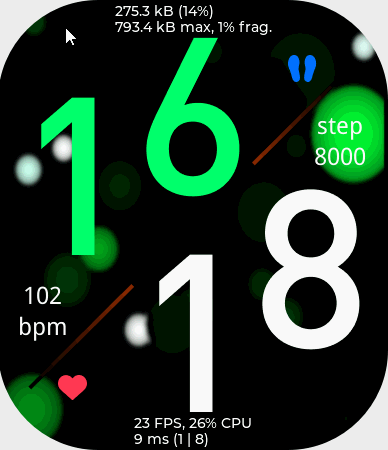
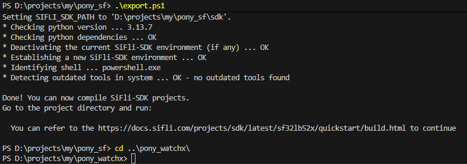
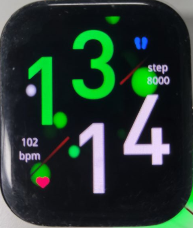

# 前言

pony_watchx 是一个开源的智能手表项目，基于 pony 平台（pony 是一个 RTOS 项目的总称）。

# 目录结构
|一级目录|二级目录|说明|
|:---|:---|:---|
|3rdparty||依赖的第三方库|
||[lv_advanced](https://gitee.com/icanpool/lv_advanced)|基于 LVGL 实现的高级组件库|
|include||对外头文件|
|platform||支持运行的平台|
||common|平台公共|
||sifli|思澈平台|
||simulator|模拟器|
|res||字体、图片等资源文件|
|src||源码|

# 快速开始

## 下载代码
```bash
git clone --recursive https://gitee.com/icanpool/pony_watchx.git
```

## Qt 模拟器
### 依赖
- Qt 5.15+ (Windows + MSVC/MINGW)

### 运行
- 用 Qt Creator 打开 platform/simulator/qt/watchx_xxx_yyy/watchx.pro 工程
- 编译、运行

下面是立创·黄山派的 390*450 (四角弧半径 100) 设备的模拟效果图




# 嵌入式平台
## sifli (思澈平台)

在 sifli 平台上，本项目仅作为一个应用，所以需要 sifli 的基础环境才可以编译和运行。

pony_sf 是一个基于思澈开源 SDK 开发的 pony-RTOS 项目，同时也将作为本项目依赖的 sifli 基础环境。

### 准备工作
- 请访问 [pony_sf](https://gitee.com/icanpool/pony_sf) 完成基础环境的配置
- 准备支持的硬件设备

### 操作步骤
假设：pony_sf 和 pony_watchx 在同级目录。

- 在 powershell 终端中先进入 pony_sf 目录执行 .\export.ps1，再进入 pony_watchx 目录
```powershell
cd pony_sf
.\export.ps1
cd ..\pony_watchx
```

- 然后进入 .\platform\sifli\project\ 目录
```powershell
cd .\platform\sifli\project\
```

### pony_sf @ sf32lb52-lchspi
以 “立创·黄山派SF32LB52” 为例，编译和下载
```powershell
scons --board=sf32lb52-lchspi-ulp -j8
.\build_sf32lb52-lchspi-ulp_hcpu\uart_download.bat
```




# 规范
- 代码 git 提交格式：[git 知：提交格式](https://blog.csdn.net/canpool/article/details/126005367)
- 代码 style 规范 [.clang-format](./.clang-format)

# 贡献
- 欢迎提交 issue 对关心的问题发起讨论
- 欢迎 Fork 仓库，pull request 贡献

# 后语
加油，我们！
